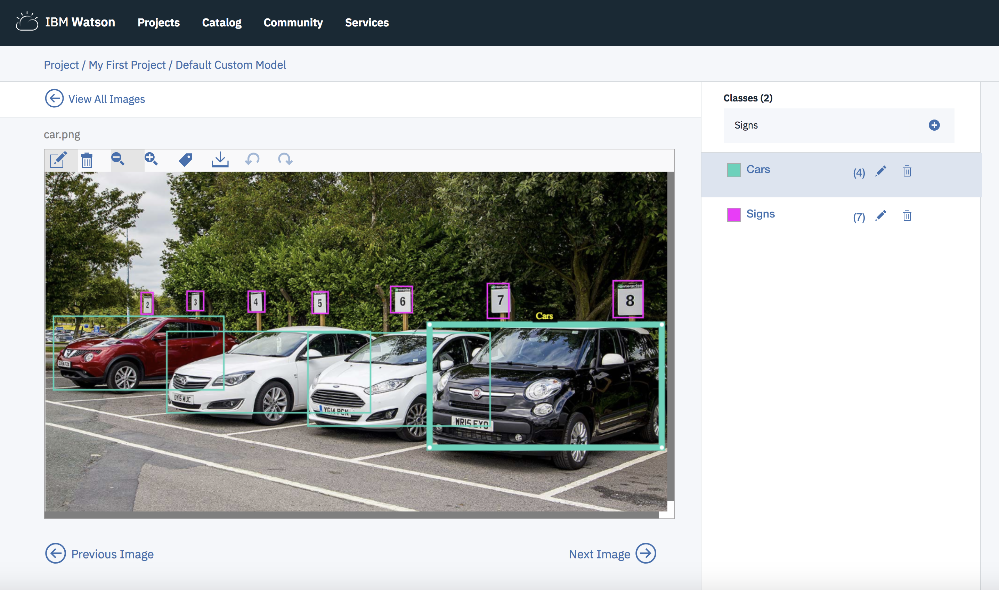

# Object detection boxing prototype

Over the summer one of my projects as an intern was to develop a prototype for user testing for the Watson Visual Recognition's Object Detection feature. I used a lot of the documentation in the open source tool VGG Image Annotator and I personally thought it was a very helpful tool for some functionality of the prototype and should be looked at if anything for inspiration on implementing some functions and that sort of thing. Below I included my documentation for my prototype that was not already included in the VGG Image Annotator with references to the open source material where appropriate. 

Link for open source tool documentation: 

# Overview
This prototype consists of the following screen. 

# documentation not from VGG Image Annotator

VIA provided an object of type ImageMetadata they used which I modified appropriately to fit our needs for the object detection model. Data structures include maps used to represent the classes the user creates, and all the boxes/annotations in the photo album the user is working on. 

### Data Structures

Relevant data structures in the open source tool include:
_via_canvas_regions
_via_image_id_list
_via_file_attributes
_via_region_attributes 

and documentation of those as well as those for constants and classes ImageMetadata and ImageRegion can be found at:
https://gitlab.com/vgg/via/blob/master/CodeDoc.md

_via_color_array is a string of arrays that was created so for use of other functions so the prototype could have different colors for newly created classes rather than just having all the classes be the same color when the user creates a class. 

_via_class_names is a Map that keeps track of all the classes the user creates for their model. Each entry in this Map has a key value of type string of the class name and a value of type Array with 2 entries, the 1st an integer of how many regions of that class have been created, and the second entry of type string that is the hex color representation of the color of the boxes of that class. 

The file explorer is accessible using the button in left corner of the navigation bar. You can create a new file by clicking the **New file** button in the file explorer. You can also create folders by clicking the **New folder** button.

### Functions
All inline javascript functions were moved to file _via_main.js and added with event listeners instead to avoid inline styling

All functions modified from the open source or not initially a function in the open source documentation are below.

import_annotations_from_csv was modified with a call to function repopulate() to ensure that importing annotations also updates are class names and appropriate data structures. 

_via_load_canvas_regions was modified so upon loading the canvas the page is also updated to include all the image metadata the user made earlier in the session by updating the canvas and data structures by using page_data as reference.

del_sel_regions was modified to not only delete regions on canvas but also to update removal of the regions in our data structures, specifically for the map _via_class_names. 

update_count takes a parameter as a class name and updates the HTML to show the number of regions in the _via_class_names data structure appropriately. 

select_regions has been updated to select all regions of a class name, taking in a single parameter of type string of a class name. 

addClass is a function that creates the class when the user inputs the class name into the form with id submit_add. The _via_class_names map is updated to include this new class. There are also new HTML elements with javascript listeners added so that the class the user creates can be manipulated as they see fit. These HTML elements and event listeners include buttons and functionality for these buttons for editing the name of the class, changing the color of labels for the class, deleting the class, and selecting the class for drawing by clicking on the appropriate button. 

turnOffShortcuts is a function that turns off keyboard shortcuts while the user is typing in the class name so there is no unwanted actions or functions called on key presses during the input of the class name. 

repopulate is a function that updates the _via_class_names Map based on _via_img_metadata.